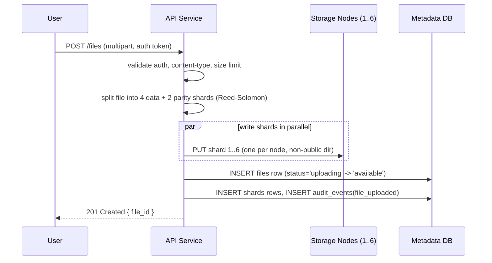
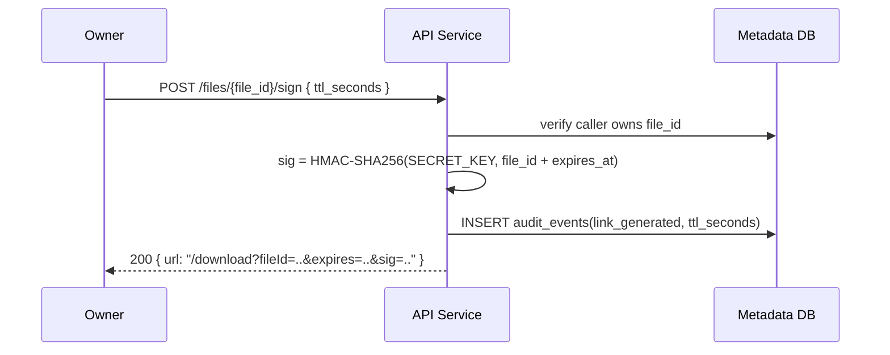
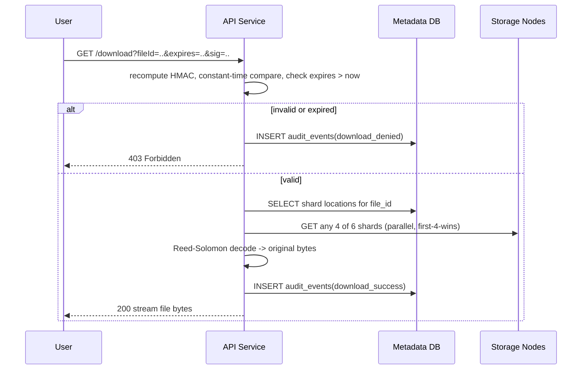

# System Design: Distributed Secure File Sharing Service (DigitalOcean, Erasure-Coded)

> Incorporates the structure and edge-case analysis from `docs/Signed File Vault.html` (an earlier baseline design captured for this project), extended so that the erasure-coded, multi-node architecture is the **actual build target** for this exercise — not a future-only reference. Python is the implementation language.

## 1. Scope & Requirements

A REST service that lets a user upload private files, stores them redundantly on the local file system of a small storage-node fleet (never in a public object store), and issues time-limited, cryptographically signed download links. Requirements, taken from the brief:

| # | Requirement | Where addressed |
|---|---|---|
| 1 | Secure ingestion — non-public directory, file associated with a user ID | §3 (Upload), §6 (storage nodes never publicly reachable) |
| 2 | Signer endpoint — file ID + TTL → signed URL that survives a restart | §4 (Signed URL Design) |
| 3 | Public retrieval endpoint — validates signature + expiry, serves file | §3 (Download) |
| 4 | Owner metadata query — filename, size, upload date, status | §2 data model (`files` table), API surface |
| 5 | Audit event on every signed-link generation | §4, `audit_events` table |
| 6 | Architecture flow diagram in the repo | §3 |
| 7 | Validation, error handling, edge cases | §5 |
| 8 | Tests, CI/CD, documentation | implementation phase, not this doc |
| 9 (this project's added constraint) | Distributed storage with erasure-coded redundancy | §6, §7 |

The redundancy requirement changes what "non-public directory on the local file system" means: instead of one directory on one Droplet, the file is split into shards and each shard lives in a non-public directory on a different storage node. Ownership, the local-disk storage model, and the audit/signing contract are unchanged from a single-node design — only *where* the bytes live and how they're reassembled differs.

## 2. Data Model (Postgres)

```sql
CREATE TABLE users (
  id            UUID PRIMARY KEY DEFAULT gen_random_uuid(),
  email         TEXT UNIQUE NOT NULL,
  created_at    TIMESTAMPTZ NOT NULL DEFAULT now()
);

CREATE TABLE files (
  id              UUID PRIMARY KEY DEFAULT gen_random_uuid(),
  owner_user_id   UUID NOT NULL REFERENCES users(id),
  original_name   TEXT NOT NULL,
  content_type    TEXT NOT NULL,
  size_bytes      BIGINT NOT NULL,
  checksum_sha256 TEXT NOT NULL,
  status          TEXT NOT NULL DEFAULT 'uploading', -- uploading | available | degraded | deleted
  uploaded_at     TIMESTAMPTZ NOT NULL DEFAULT now(),
  deleted_at      TIMESTAMPTZ
);
CREATE INDEX idx_files_owner ON files(owner_user_id);

CREATE TABLE storage_nodes (
  id            UUID PRIMARY KEY DEFAULT gen_random_uuid(),
  hostname      TEXT NOT NULL,
  private_ip    INET NOT NULL,
  status        TEXT NOT NULL DEFAULT 'healthy' -- healthy | unreachable | decommissioned
);

CREATE TABLE shards (
  id              UUID PRIMARY KEY DEFAULT gen_random_uuid(),
  file_id         UUID NOT NULL REFERENCES files(id),
  shard_index     SMALLINT NOT NULL,      -- 0-5 for a 4+2 scheme
  kind            TEXT NOT NULL,          -- data | parity
  node_id         UUID NOT NULL REFERENCES storage_nodes(id),
  checksum_sha256 TEXT NOT NULL,
  size_bytes      BIGINT NOT NULL,
  created_at      TIMESTAMPTZ NOT NULL DEFAULT now()
);
CREATE INDEX idx_shards_file ON shards(file_id);

CREATE TABLE audit_events (
  id              UUID PRIMARY KEY DEFAULT gen_random_uuid(),
  file_id         UUID NOT NULL REFERENCES files(id),
  actor_user_id   UUID REFERENCES users(id),
  event_type      TEXT NOT NULL, -- link_generated | download_success | download_denied | file_uploaded
  ttl_seconds     INT,
  ip_address      INET,
  created_at      TIMESTAMPTZ NOT NULL DEFAULT now()
);
CREATE INDEX idx_audit_file ON audit_events(file_id);
```

The signed token itself is never persisted — it is stateless by construction (§4). `shards` is the only addition versus a single-node design; everything else is the same schema a non-distributed version would use.

## 3. Architecture & Request Flow

```mermaid
flowchart LR
    U[User] -->|HTTPS| LB[DO Load Balancer<br/>TLS termination]
    LB --> API[API Service (FastAPI/Python)<br/>auth, encode/decode, sign/verify, audit]
    API <-->|SQL| DB[(DO Managed Postgres<br/>files, shards, audit_events)]
    API <-->|shard PUT/GET, private VPC only| N1[(Node 1<br/>DO Volume)]
    API <--> N2[(Node 2)]
    API <--> N3[(Node 3)]
    API <--> N4[(Node 4)]
    API <--> N5[(Node 5)]
    API <--> N6[(Node 6)]
```

Storage nodes are plain services (Python, e.g. Flask/FastAPI) that expose `PUT/GET/DELETE /shards/{shard_id}` writing to a **non-public directory** on local disk — the same "local file system, outside the web root, UUID-named" pattern as a single-node baseline, just replicated onto 6 hosts instead of 1. They are never reachable from outside the DO VPC; the API service is the only public surface.

### Upload



If any shard write fails, the API deletes the shards that did succeed and returns `502` — partial uploads are never left half-written (`status` never reaches `available` unless all 6 acks succeed).

### Signed URL Generation



### Download / Retrieval (public endpoint)



Fetching "any 4 of 6" (not always the same 4) is what makes 1–2 node outages transparent to the client — no special-casing which node is down.

## 4. Signed URL Design

The restart-survival requirement is about the **signature**, not the storage. An in-memory token map (`{token: {fileId, expiresAt}}`) is ruled out because a restart clears it and every previously issued link would 404 even though the shards are untouched on disk.

```
GET /download?fileId=<id>&expires=<unix_ts>&sig=<hmac>

sig = HMAC-SHA256(SECRET_KEY, fileId + expires)
```

- `SECRET_KEY` is long-lived config (DO App Platform encrypted env var), identical before and after a restart — never generated at process boot.
- Validation recomputes the HMAC from the query params and does a constant-time comparison (`hmac.compare_digest`); no DB or in-memory lookup is needed to check signature validity or expiry.
- A DB lookup by `fileId` is still required to resolve shard locations and to write the audit row — that's independent of the signature check itself.
- Key rotation: prefix a key ID (`kid.fileId.expires.sig`) so old links keep validating while a new secret rolls out.
- This mirrors how S3/Spaces presigned URLs work: self-contained signature against a fixed secret, no server-side session required.

## 5. Edge Cases & Failure Modes

| Scenario | Risk | Mitigation |
|---|---|---|
| Client-supplied filename used as storage path | path traversal | Store by server-generated UUID + shard index; original filename kept only as metadata for `Content-Disposition`. |
| API process restarts | links break if tokens are looked up in memory | Stateless HMAC signature keyed off a persistent secret — no in-memory token table. |
| 1–2 storage nodes down or a disk lost entirely | data loss risk on a single node | Reed-Solomon 4+2: any 4 of 6 shards reconstruct the file; tolerates 2 simultaneous node losses (§7). |
| More than 2 nodes down for one file | file temporarily unreconstructable | `files.status` flips to `degraded`; surfaced via metadata API and alerting rather than silently failing. |
| Per-user storage quota checked then written across concurrent requests | TOCTOU race | Atomic DB update (`UPDATE ... SET used = used + size WHERE used + size <= limit`) or row lock, never app-level check-then-write. |
| Concurrent audit-event/metadata inserts across API instances | none — independent rows | No special handling required; Postgres row-level atomicity covers it. |
| Silent disk corruption / bit rot on one node | undetected corruption | Per-shard SHA-256 checksum stored at write time and verified on every read; a background scrub job detects mismatches and triggers repair (§7). |
| Metadata DB unavailable | could serve unaudited/unauthenticated downloads | Service fails closed (503) rather than skipping the ownership/audit path. |
| Swapping to native Spaces/S3 presigned URLs | bypasses ownership check + audit log | If ever adopted, ownership check and audit write must stay in the app before generating any link; stream through the app rather than redirecting to a native presigned URL. |

## 6. Deployment Topology (DigitalOcean)

| Component | DO Resource |
|---|---|
| Public entrypoint | DO Load Balancer (TLS termination, health checks) |
| API service | DO App Platform or a Droplet pool in an autoscaling group, private VPC |
| Storage nodes | 6+ Droplets (one per shard slot, plus spares), each with an attached DO Volume; **no public IP** |
| Metadata DB | DO Managed PostgreSQL, automated backups, PgBouncer pooling |
| Secrets (`SECRET_KEY`, DB creds) | DO App Platform encrypted environment variables |
| Observability | DO Monitoring on node disk + API latency; structured JSON logs to a log sink |

Everything except the load balancer and API service sits in a private VPC with no public IP — storage nodes and the database are unreachable from the internet, satisfying "non-public directory" at the network level as well as the filesystem level.

## 7. Redundancy: Erasure-Coded Storage (build target, not future-only)

Reed-Solomon **4+2** (`k=4` data shards, `m=2` parity shards, 6 total per file):

- Storage overhead: 1.5× (vs. 3× for 3-way replication).
- Fault tolerance: any 2 of 6 storage nodes can be down or lost and the file is still reconstructable.
- Library: `reedsolo` (pure Python, no C toolchain dependency — fastest to build/test/containerize for this exercise; a production follow-up could swap in `pyeclib`/`liberasurecode` for higher throughput).
- Placement: each of the 6 shards for a given file is written to a **different** storage node so a single node failure costs exactly one shard.

**Upload**: file → 4 data shards + 2 parity shards (computed with `reedsolo`) → one shard PUT per node → metadata DB records `{shard_index → node_id, checksum}` per shard.

**Download**: signature/expiry validated exactly as in §4 (unchanged by the distributed layer) → fetch any 4 of the 6 shards → Reed-Solomon decode → stream reconstructed bytes → audit event recorded.

**Repair**: a background job periodically verifies shard checksums, detects missing/corrupt shards or dead nodes, reconstructs them from the remaining 4, and rewrites them to a healthy node, updating the metadata pointers. This is what actually delivers durability — data survives node loss because it is *reconstructable*, not because any one node is specially protected.

Scoped honestly for this exercise: the coordinator (encode/place on upload, fetch-any-4/decode on download) and a basic checksum-verify-and-reconstruct repair job are what get built. A production-grade version would add write quorums, split-brain handling, and automatic rebalancing on node join/leave — real systems work beyond this exercise's scope, called out explicitly rather than silently skipped.

## 8. Alternatives Considered

- **DigitalOcean Spaces (S3-compatible)**: has native presigned URLs (stateless, restart-safe) but no concept of file ownership, no audit hook, and no erasure-coding control — DO already replicates internally but that's opaque redundancy, not something we can demonstrate as "erasure coding for redundancy." Not chosen because the objective is to build and show the distributed/erasure-coded design, not depend on a managed object store's internals.
- **Self-hosted MinIO (erasure-coded mode)**: gets Reed-Solomon, self-healing, and an S3-compatible API running on DO Droplets without hand-building the coordinator/repair logic. This is the pragmatic production choice, but it would replace the custom implementation this exercise is meant to demonstrate, so it's noted here as the recommended real-world path rather than adopted for the deliverable.
- **Single-node baseline (local disk, no erasure coding)**: simplest, satisfies the literal brief, but does not satisfy this project's explicit "distributed file system, use erasure coding for redundancy" requirement — superseded by §6/§7 as the actual build target.

## 9. Recommendation & Phasing

1. **This exercise (build target):** the erasure-coded, multi-node architecture in §3/§6/§7 — Python API service, 6-node storage fleet (can run as 6 local processes/containers for dev, real Droplets for the DO deployment), Postgres metadata + audit, stateless HMAC signed URLs.
2. **Production hardening (not built here, documented as follow-up):** write quorums / split-brain handling in the repair service, automatic rebalancing on node join/leave, mTLS between API and storage nodes.
3. **Longer-term alternative:** migrate to self-hosted MinIO (erasure-coded mode) or DO Spaces if operating a hand-rolled coordinator/repair service becomes more overhead than it's worth at scale — treat §7 as the reference for *how* erasure-coded durability works even after such a migration.
