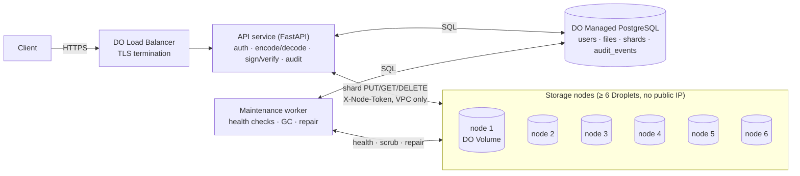

# System Design: Distributed Secure File Sharing Service (DigitalOcean, Erasure-Coded)

> Builds on an earlier single-node baseline design (kept outside the repo). That design treated the erasure-coded, multi-node architecture as a future reference only; here it is the **actual build target**. Implementation: Python 3.12, FastAPI, PostgreSQL, `zfec`.

## 1. Scope & Requirements

A REST service that lets a user upload private files, stores them redundantly on the local file systems of a small storage-node fleet (never in a public object store), and issues time-limited, cryptographically signed download links.

| # | Requirement (from the brief) | Where addressed |
|---|---|---|
| 1 | Secure ingestion: non-public directory, file associated with a user ID | §4 Upload, §7.2, §10 |
| 2 | Signer endpoint: file ID + TTL → signed URL that survives a restart | §6 |
| 3 | Public retrieval endpoint: validates signature + expiry, serves file | §4 Download, §6 |
| 4 | Owner metadata query: filename, size, upload date, status | §2, §3 |
| 5 | Audit event on every signed-link generation | §3, §6 |
| 6 | Architecture flow diagram in the repo | §4 |
| 7 | Validation, error handling, edge cases | §9 |
| 8 | Tests, CI/CD, README | `tests/`, `.github/workflows/ci.yml`, `README.md` (`docs/PROGRESS.md` stages 9–10) |
| 9 | *Project constraint:* distributed storage with erasure-coded redundancy | §7, §10 |

Under the redundancy requirement, "non-public directory on the local file system" works like this: each file is split into shards, and each shard lives in a non-public directory on a *different* storage node. Storage nodes accept connections only from inside the private network.

**Out of scope:** multi-region replication, client-side encryption, resumable or multipart uploads, per-user quotas. Known limitations are listed in §12.

## 2. API Surface

| Method & path | Auth | Purpose | Success |
|---|---|---|---|
| `POST /files` | API key | Upload a file (multipart) | `201 {file_id, …}` |
| `GET /files` | API key | List the caller's files (paginated) | `200` |
| `GET /files/{file_id}` | API key | One file's metadata + shard health summary | `200` |
| `POST /files/{file_id}/links` | API key | Issue a signed download URL `{ttl_seconds}` | `201 {url, expires_at}` |
| `DELETE /files/{file_id}` | API key | Delete a file; revokes all its links | `204` |
| `GET /download/{file_id}?exp&v&kid&sig` | Signed URL | Public retrieval | `200` file bytes |
| `GET /healthz` | none | Liveness for the load balancer | `200` |

Accessing another user's file returns `404`, not `403`, so the API never confirms that a given file ID exists.

## 3. Data Model (PostgreSQL)

The source of truth is `src/api_service/db/models.py`, applied by Alembic. All timestamps are `TIMESTAMPTZ`. Enumerated columns are enforced with `CHECK` constraints.

| Table | Key columns | Notes |
|---|---|---|
| `users` | `id`, `email` (unique), `api_key_hash` (unique) | Only the SHA-256 of the API key is stored (§5) |
| `files` | `owner_user_id`, `original_name`, `content_type`, `size_bytes` (> 0), `checksum_sha256`, `data_shards`, `parity_shards`, `link_version`, `status` ∈ {uploading, available, deleted}, `uploaded_at`, `deleted_at` | Stores k/m **per file**, so changing the global config never makes an existing file undecodable. `link_version` is part of every signature (§6). Index on `owner_user_id`. |
| `storage_nodes` | `address` (`host:port`, unique), `status` ∈ {healthy, unreachable, decommissioned}, `last_seen_at` | **Single source of truth** for node addresses. Bootstrapped by `scripts/seed_storage_nodes.py`. |
| `shards` | `file_id` (FK, cascade), `shard_index`, `kind` ∈ {data, parity}, `node_id`, `checksum_sha256`, `size_bytes` | `UNIQUE (file_id, shard_index)`; the same index serves lookups by file. Index on `node_id` for repair scans. `shards.id` is also the object key on the node. |
| `audit_events` | `event_type` ∈ {file_uploaded, link_generated, download_success, download_denied, file_deleted}, `file_id` (nullable), `actor_user_id` (nullable), `ttl_seconds`, `ip_address`, `created_at` | `file_id` is nullable so a denied request for a nonexistent file can still be recorded. Indexed by `file_id` and `created_at`. |

A file's availability is **not stored**. It is computed at query time from how many of its shards sit on healthy nodes (§7.5), so it can't drift out of date the way a stored `degraded` flag would.

## 4. Architecture & Request Flows



Storage nodes are simple FastAPI services exposing `PUT/GET/DELETE /shards/{shard_id}` (§7.2). Only the API service is exposed to the internet. The maintenance worker uses the same image with a different entrypoint.

### Upload

```mermaid
sequenceDiagram
    participant U as Client
    participant API as API service
    participant DB as PostgreSQL
    participant N as Storage nodes

    U->>API: POST /files (multipart, Bearer API key)
    API->>API: authenticate; stream body with size cap; reject empty
    API->>API: SHA-256 whole file; zfec encode → k data + m parity shards
    API->>DB: pick k+m distinct healthy nodes (fewer → 503)
    API->>DB: BEGIN; INSERT files(status=uploading) + shards rows; COMMIT
    par one shard per node
        API->>N: PUT /shards/{shard_id} (X-Checksum-Sha256)
    end
    alt all k+m writes acknowledged (201)
        API->>DB: UPDATE status=available; INSERT audit(file_uploaded)
        API-->>U: 201 {file_id, size, uploaded_at}
    else any write fails
        API->>N: best-effort DELETE written shards
        API->>DB: DELETE files row (cascades to shards)
        API-->>U: 503 (not enough nodes) / 502 (node error)
    end
```

The database rows are written **before** any shard bytes. If the API crashes mid-upload, the worker's GC (§7.6) finds the stale `uploading` row, whose shard rows list every shard ID and node, so nothing is left orphaned.

### Signed link generation

```mermaid
sequenceDiagram
    participant U as Owner
    participant API as API service
    participant DB as PostgreSQL

    U->>API: POST /files/{id}/links {ttl_seconds}
    API->>API: authenticate; validate TTL bounds
    API->>DB: SELECT file WHERE id AND owner = caller AND status = available
    API->>API: sig = HMAC-SHA256(key[kid], canonical payload) — §6
    API->>DB: INSERT audit(link_generated, ttl_seconds, ip)
    API-->>U: 201 {url, expires_at}
```

### Download (public)

```mermaid
sequenceDiagram
    participant U as Anyone with the link
    participant API as API service
    participant DB as PostgreSQL
    participant N as Storage nodes

    U->>API: GET /download/{id}?exp&v&kid&sig
    API->>API: rate limit per client IP (429)
    API->>API: strict parse; exp > now; constant-time HMAC compare
    API->>DB: SELECT file + shards + node status
    alt bad signature / expired / revoked (v ≠ link_version) / not available
        API->>DB: INSERT audit(download_denied)
        API-->>U: 403 (bad or expired link) · 404 (file gone)
    else valid
        par fetch k shards, data shards first, per-request timeout
            API->>N: GET /shards/{shard_id}
        end
        API->>API: any fetch failing or checksum ≠ shards.checksum_sha256 → try the next shard
        API->>API: zfec decode; trim padding; verify whole-file SHA-256
        API->>DB: INSERT audit(download_success)
        API-->>U: 200 application/octet-stream, Content-Disposition: attachment
    end
```

Up to m shard failures of any kind (node down, timeout, corrupt data) are handled on the same path: fetch another shard. Fewer than k usable shards returns `503`.

## 5. Authentication

- Each user gets one API key, shown exactly once when `scripts/create_user.py` creates the user. Format: `sfs_` plus 32 random bytes, base64url-encoded.
- Only `SHA-256(key)` is stored (`users.api_key_hash`). A slow KDF like bcrypt protects low-entropy passwords; it adds nothing for a 256-bit random secret. Lookup is by hash through a unique index, so response timing reveals nothing about the key.
- Clients send `Authorization: Bearer <key>`. Every failure (missing, malformed or unknown key) returns the same `401`.
- Rotating a key means issuing a new one, which overwrites the hash. There's no self-service key management in scope.

## 6. Signed URL Design

The restart requirement is about the **signature**, not storage. An in-memory token table would be wiped on restart, and every outstanding link would break. Tokens are therefore stateless:

```
GET /download/{file_id}?exp=<unix_seconds>&v=<link_version>&kid=<key_id>&sig=<base64url>

payload = "sfs-download-v1\n{kid}\n{file_id}\n{exp}\n{link_version}"
sig     = HMAC-SHA256(signing_keys[kid], payload)
```

- **Restart-safe:** signing keys are long-lived config (encrypted env vars) and are never generated at boot. Any API instance can verify any link.
- **Unambiguous payload:** fields are newline-delimited under a fixed version prefix. Changing any field, or shifting the boundary between two fields, changes the signed bytes.
- **Key rotation:** `kid` selects the key. The config holds the current signing key plus older keys that are accepted for verification only, so links issued before a rotation keep working until they expire.
- **Revocation:** `link_version` is signed into every link. Deleting a file, or revoking its links, increments it, which invalidates every outstanding link for that file without affecting other files.
- **Verification order:** strict parsing (malformed input gets `403` with no detail), then the expiry check, then a constant-time HMAC compare (`hmac.compare_digest`). All of this happens before any database lookup. The database is then checked for `status = available` and a matching `link_version`.
- **TTL bounds:** integer seconds from 60 s to 7 days (configurable). Anything else gets `422`.
- **Token leakage:** signatures in query strings end up in proxy logs and `Referer` headers. Mitigations: short TTLs, `Referrer-Policy: no-referrer`, and redacting `sig` in our access logs.
- **Clock skew:** DigitalOcean hosts are NTP-synced, and a few seconds of drift is negligible against a 60-second minimum TTL.

This is the same model as S3 and Spaces presigned URLs: a self-contained signature under a fixed secret, with no server-side session.

## 7. Distributed Storage & Erasure Coding

### 7.1 Coding scheme

- **Default 4+2** (k = 4 data shards, m = 2 parity shards): 1.5× storage overhead, and any 2 of the 6 shards can be lost.
- **Library: `zfec`**, an erasure codec from Tahoe-LAFS written as a C extension, that does exactly k-of-n file encoding. Its first k output blocks are the original data, so decoding when all data shards are present is nearly free. Rejected alternatives: `reedsolo`, which is a byte-level codec capped at 255-byte codewords and would need per-byte-column encoding in pure Python; and `pyeclib`, which needs the `liberasurecode` system library.
- **Padding:** the file is padded to a multiple of k bytes before encoding. Decoding trims back to `files.size_bytes`.
- k and m are validated at startup (k, m ≥ 1, k + m ≤ 256, zfec's limit) and stored on each file row.

### 7.2 Storage node

- Each shard is stored as a single file named by its canonical UUID. Any other ID format is rejected, which rules out path traversal.
- **On-disk format:** a 32-byte SHA-256 digest followed by the payload, in one file, so data and checksum can never be written or replaced separately.
- **Atomic, durable writes:** write to a temp file and `fsync`, then `link()` it into place, which atomically fails if a shard with that ID already exists (`409`). Then `fsync` the directory. A crash never leaves a half-written shard, and a write is acknowledged only once it's on disk.
- **Shards are immutable.** Repair writes shards under new IDs rather than overwriting.
- **Integrity checks at three layers:** `X-Checksum-Sha256` on PUT catches corruption in transit; the stored digest is checked on every GET to catch bit rot (returns `500` with `X-Shard-Status: corrupt`, so callers can tell corruption from an outage); and the API compares each shard against `shards.checksum_sha256` and the rebuilt file against `files.checksum_sha256`.
- **Limits and errors:** bodies are streamed with a hard cap (`413`), empty bodies return `400`, and a full disk returns `507`.
- **Caller authentication:** `X-Node-Token` is a shared secret checked in constant time, so another tenant or service in the VPC can't read or delete shards. `/healthz` is unauthenticated so the load balancer and Docker can probe it.
- Runs as a non-root user. Shard files are created with mode `0600`.

### 7.3 Placement

- Uploads need **k + m distinct healthy nodes**. Otherwise the API returns `503` rather than accepting a file with reduced redundancy.
- Nodes are chosen at random among healthy nodes, which spreads load and capacity roughly evenly. Capacity-aware placement is a follow-up (§12).
- Node addresses come from `storage_nodes`, not from config, because shard rows point at a `node_id` that must stay resolvable even after config changes.

### 7.4 Memory and concurrency bounds

- In this version, each transfer holds the whole file plus its shards in memory: about 2.5× the file size at peak.
- With the defaults (`max_upload_bytes` = 100 MB, `max_concurrent_transfers` = 4 per instance, enforced by a semaphore that returns `503` when saturated), that's about 1 GB of peak memory per API instance. Instances must be sized to match.
- Encoding and hashing run in a thread pool, so they never block the event loop.
- Before raising the upload cap, check App Platform's request-size and timeout limits. Streaming large files in fixed-size segments is a follow-up (§12).

### 7.5 Node health and file availability

- The worker probes each node's `/healthz` every 15 s. After 3 consecutive failures it marks the node `unreachable`; the first successful probe marks it `healthy` again. `last_seen_at` records when the node last responded.
- A file's availability is computed as *usable shards* = shards on non-`decommissioned`, `healthy` nodes:
  - `healthy`: all k + m shards are usable
  - `degraded`: between k and k + m − 1 are usable
  - `unavailable`: fewer than k are usable
- Downloads still try nodes that are marked `unreachable` as a last resort, because health data can be up to one probe interval old.

### 7.6 Maintenance worker

The worker runs as a single replica. On startup it takes a session-level Postgres advisory lock and holds it for its lifetime, so an accidental second replica waits as a hot standby instead of running the same jobs at the same time. The worker exits if its lock connection drops, so it can never keep running after losing the lock.

- **Upload GC:** finds files still `uploading` after 15 minutes, deletes their shards from the nodes (a `404` counts as success), then deletes the rows.
- **Deletion GC:** for files marked `deleted`, retries shard deletes until every node confirms, then removes the shard rows. The file row stays as a tombstone so audit history remains linked to it.
- **Scrub:** slowly re-reads shards, which verifies them against the node's stored digest and the database checksum, to find corruption before it's needed.
- **Repair:** for any shard that is corrupt, or whose node has been `unreachable` for more than 30 minutes (so a reboot doesn't trigger a rebuild), it fetches k good shards and regenerates the missing block with zfec. The new block is written under a new shard ID to a healthy node that doesn't already hold a shard of this file, and the shard row is repointed.

### 7.7 Deletion

`DELETE /files/{id}` sets `status = deleted` and `deleted_at`, increments `link_version` (revoking every link), and writes a `file_deleted` audit row. It then makes a best-effort attempt to delete the shards; the worker finishes any that fail.

## 8. Download Response Hardening

The client-supplied content type and filename are stored as metadata only; neither is trusted when serving. If we served `text/html` back from our own origin, a browser would render it, which is stored XSS.

- Response headers:
  - `Content-Type: application/octet-stream`
  - `Content-Disposition: attachment; filename="<ASCII fallback>"; filename*=UTF-8''<percent-encoded>`
  - `X-Content-Type-Options: nosniff`
  - `Content-Security-Policy: default-src 'none'; sandbox`
  - `Cache-Control: no-store`
  - `Referrer-Policy: no-referrer`
- Filename sanitization on upload: take only the basename, strip control characters (including CR/LF), and cap the length at 255 bytes. An empty result becomes `"file"`.

## 9. Edge Cases & Failure Modes

| Scenario | Risk | Handling |
|---|---|---|
| Client filename used as a storage path | Path traversal | Storage is keyed by server-generated UUID; the node accepts only canonical UUIDs. The filename is kept only as sanitized metadata (§8). |
| Malicious filename or content type served back | Header injection, stored XSS | Download headers are fixed and hardened, with RFC 5987 filename encoding (§8). |
| Empty file | Nothing to encode; the node rejects empty shards | `400` on upload. |
| Oversized upload, or a false `Content-Length` | Memory exhaustion | The byte count is enforced while streaming, whatever the headers say. `413`. |
| Too many concurrent transfers | Memory exhaustion | Per-instance semaphore; `503` when saturated (§7.4). |
| Missing, invalid or unknown API key | Unauthorized access | Uniform `401` (§5). |
| Access to another user's file | Ownership bypass, existence oracle | `404` (§2). |
| TTL ≤ 0, too large, or not an integer | Links that never expire or overflow | Bounded integer, `422` (§6). |
| Tampered, expired or malformed link | Unauthorized download | Constant-time HMAC check, expiry check, strict parsing. `403`, audited as `download_denied`. |
| Leaked link | Unauthorized download until expiry | Short TTLs, `no-referrer`, log redaction. The owner can revoke through `link_version` (§6). |
| Link to a deleted file | Serving deleted data | `status ≠ available` → `404`. `link_version` was also incremented, so old links stay dead even if the row is ever restored. |
| Service restart or key rotation | Links break | Stateless HMAC under long-lived keys; old keys remain valid for verification via `kid` (§6). |
| Denied-request flood on the public endpoint | Database write load, brute force | Per-IP rate limit (`429`) runs before any audit write or database access. |
| Spoofed `X-Forwarded-For` | Poisoned audit IPs, rate-limit bypass | Proxy headers are trusted only from the load balancer (`--forwarded-allow-ips`). |
| 1 to m nodes down, slow or corrupt | Read failure | Fetch another shard; per-request timeouts; checksums at every layer (§7.2). |
| More than m shards unusable | File unreadable | `503`; shown as `unavailable` in metadata (§7.5); alerting. |
| Fewer than k + m healthy nodes at upload | Reduced redundancy from the start | `503`. The API never writes a file with less redundancy than configured (§7.3). |
| Node disk full | Failed writes | The node returns `507`; the upload is rolled back (`502`). |
| API crash mid-upload | Orphaned shards | Rows are written before bytes, and the worker's GC cleans up (§4, §7.6). |
| Crash mid-write on a node | Torn shard | temp file → `fsync` → `link()` → directory `fsync`, so the write is atomic (§7.2). |
| Shard ID reused | Silent overwrite | Shards are immutable; the node returns `409`. |
| Bit rot or silent corruption | Serving wrong bytes | Stored digest checked on read, database checksum, whole-file checksum; scrub and repair (§7.6). |
| k or m changed after data exists | Old files can't be decoded | k and m are stored per file (§3). |
| Node address changes | Shard rows point at the wrong host | Addresses live only in `storage_nodes` and are updated there (§7.3). |
| Rogue client inside the VPC | Reading or deleting shards | `X-Node-Token` on every shard request (§7.2); mTLS is a follow-up. |
| Database unavailable | Unaudited or unauthorized access | Fail closed with `503`; no download is served without its audit row. |
| Concurrent audit or metadata inserts | None | Independent rows with UUID keys. |
| Two workers running at once | Duplicate repairs | Single replica plus a Postgres advisory lock per job (§7.6). |

## 10. Deployment Topology (DigitalOcean)

| Component | DO resource |
|---|---|
| Public entrypoint | App Platform's managed HTTPS ingress, or a DO Load Balancer for a Droplet-based API pool |
| API service | App Platform web service, 2 or more instances, in the private VPC |
| Maintenance worker | App Platform worker component (same image), 1 instance |
| Storage nodes | 6 or more Droplets, each with an attached DO Volume. **No public IP**; a cloud firewall allows port 8000 only from the VPC range |
| Metadata DB | DO Managed PostgreSQL, reached over its private VPC hostname, with automated backups |
| Secrets | App Platform encrypted env vars: `SFS_DATABASE_URL`, `SFS_SECRET_KEY`, `SFS_NODE_TOKEN`. On the nodes: `SFS_NODE_TOKEN` in a root-owned env file |
| Observability | DO Monitoring alerts on node disk usage and API latency/error rate; structured JSON logs with `sig` redacted |

The step-by-step setup is in `docs/DEPLOYMENT.md`.

## 11. Alternatives Considered

- **DigitalOcean Spaces:** offers native presigned URLs, but has no notion of file ownership, no audit hook, and gives us no control over erasure coding; its internal redundancy can't be inspected. Rejected because the goal is to build and demonstrate the erasure-coded design ourselves.
- **Self-hosted MinIO in erasure-coded mode:** provides Reed-Solomon coding, self-healing and an S3 API without building the coordinator. This is the pragmatic production choice, noted as the real-world path (§13), but adopting it would replace the part this exercise exists to demonstrate.
- **Single-node local disk:** meets the literal brief, but not this project's redundancy requirement.

## 12. Known Limitations & Follow-ups

- **Whole-file buffering** (§7.4): the next step is to encode in fixed-size segments (4–8 MB), which bounds memory regardless of file size and allows range requests.
- **Per-instance rate limits:** with N API instances, a client can get up to N× the configured limit. A global limit needs a shared store, such as DO Managed Caching (Valkey).
- **Revocation granularity:** revocation is per file (`link_version`), not per link. Revoking a single link would need a stored link ID.
- **Node-side orphans:** a shard written to a node that then dropped out before the database recorded its removal stays on that node's disk. Sweeping these needs a node `LIST` endpoint.
- **Transport security:** inside the VPC, API↔node traffic is plain HTTP with a shared token. mTLS is the hardening step.
- **Placement** ignores free capacity. Rebalancing onto newly added nodes is manual.
- **Quotas** are out of scope. If added, they must use an atomic `UPDATE … WHERE used + size <= limit`, never check-then-write.

## 13. Phasing

1. **This exercise:** everything in §2–§10, tracked stage by stage in `docs/PROGRESS.md`.
2. **Production hardening:** the items in §12.
3. **Long term:** if operating a hand-built coordinator stops being worth the cost, migrate the storage layer to MinIO in erasure-coded mode, keeping this API's authentication, signing and audit layer in front of it.
