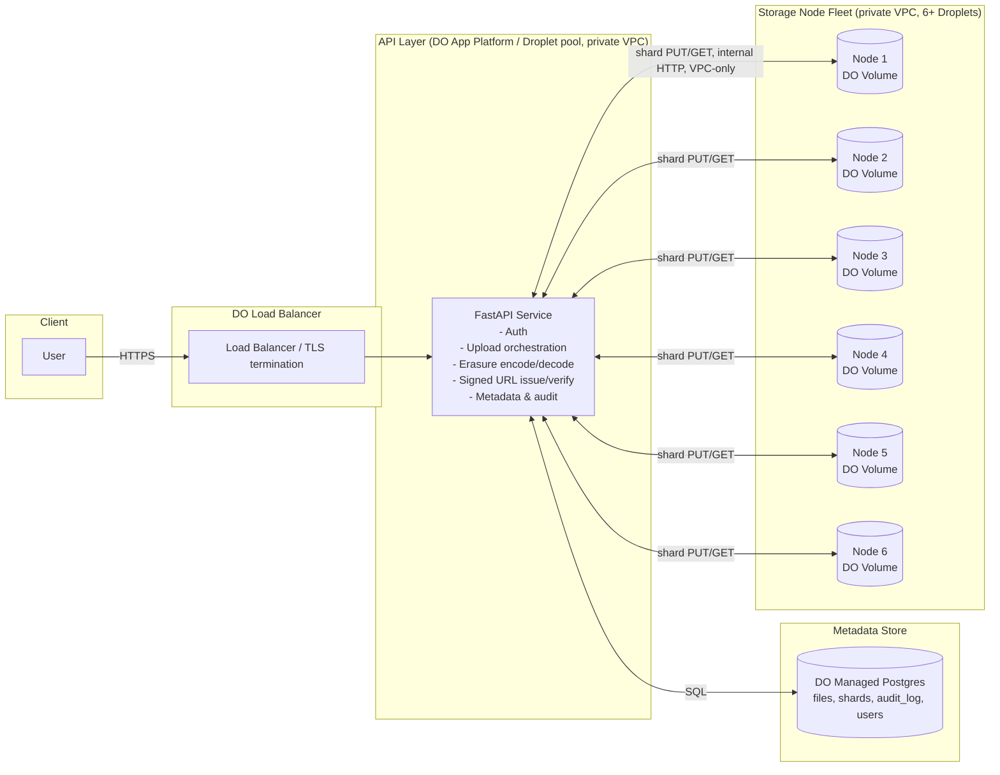
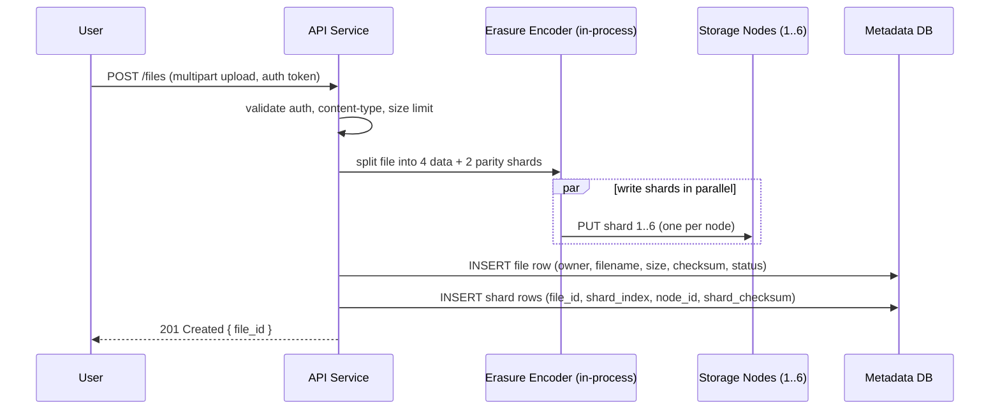
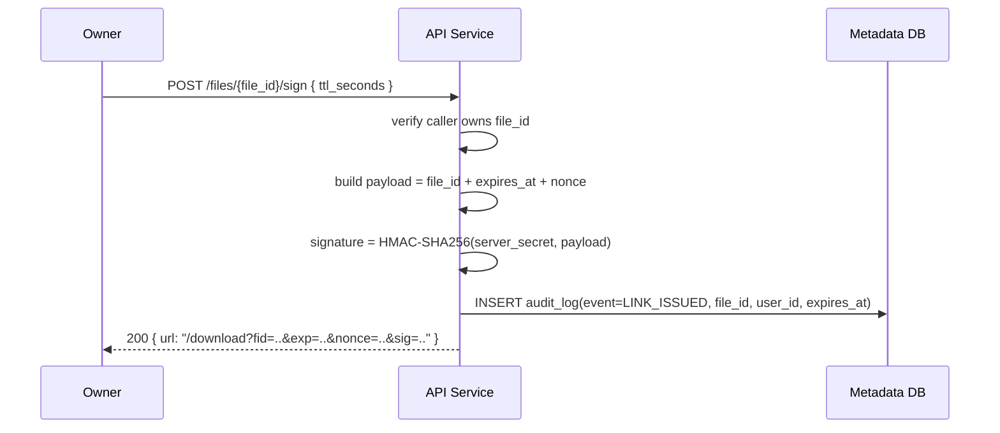
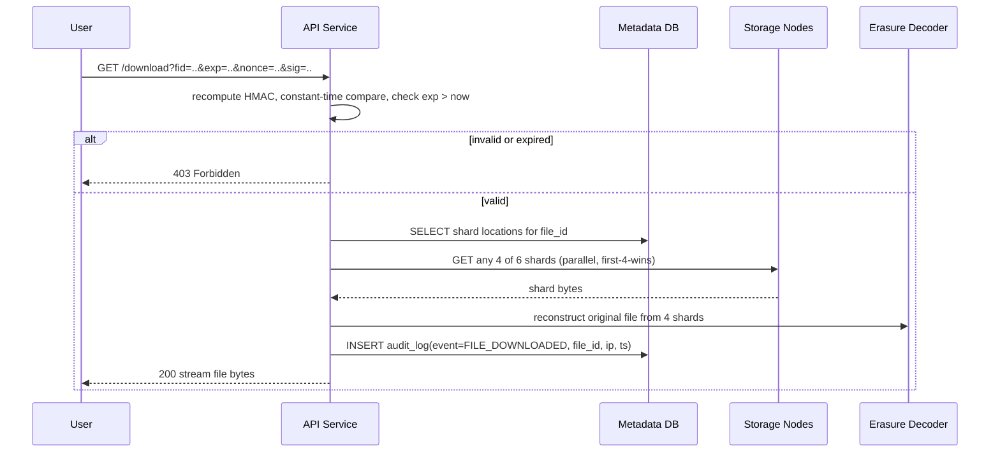

# System Design: Distributed Secure File Sharing Service (DigitalOcean, Erasure-Coded)

## 1. Goals & Scope

Build a REST API service, deployed on DigitalOcean, that:

- Ingests private files from users and stores them **redundantly across multiple storage nodes** using **erasure coding** rather than full replication.
- Issues **cryptographically signed, time-limited download URLs** that remain verifiable across service restarts (stateless signature scheme).
- Serves files after validating the signature/expiry, reconstructing the file from surviving shards if some nodes are unavailable.
- Tracks file metadata (owner, filename, size, upload date, shard placement) and audit events (every signed-link issuance and every download).

Non-goals (out of scope for this iteration): multi-region geo-replication, client-side encryption/key management, resumable/multipart uploads, real-time collaboration.

## 2. Why Erasure Coding

Pure N-way replication costs `N×` storage for tolerance of `N-1` node failures. Reed-Solomon erasure coding with `k` data shards and `m` parity shards tolerates any `m` shard losses at only `(k+m)/k×` storage overhead.

**Chosen scheme: Reed-Solomon 4+2** (`k=4` data shards, `m=2` parity shards, 6 shards total per file).

- Storage overhead: 1.5× (vs. 3× for 3-way replication).
- Fault tolerance: any 2 of 6 storage nodes can be down/lost and the file is still reconstructable.
- Library: `reedsolo` (pure Python, no C toolchain dependency — simplest to build, test, and containerize in the timeframe; can be swapped for `pyeclib`/`liberasurecode` later if throughput on large files becomes a bottleneck).
- Shard placement: each of the 6 shards is written to a **different storage node** so that a single node failure only ever costs one shard.

Small files still get split into 6 shards (padding as needed) to keep the placement and reconstruction logic uniform; a future optimization could skip EC below a size threshold and just replicate.

## 3. High-Level Architecture



Storage nodes are only reachable inside the DigitalOcean VPC — never exposed publicly. All file bytes enter/leave the system through the API layer, which is the only public surface.

## 4. Request Lifecycles

### 4.1 Upload



- Each shard is checksummed (SHA-256) before write and verified on write-ack.
- The file row is only marked `available` once all 6 shard writes are acknowledged; a partial-failure path deletes any written shards and returns `502`.

### 4.2 Signed URL Generation



The signature is **stateless**: `sig = HMAC-SHA256(SECRET_KEY, file_id | expires_at | nonce)`. Validity depends only on the server holding `SECRET_KEY` (loaded from an environment secret, not generated at process start), so a restart does not invalidate outstanding links. `SECRET_KEY` is rotated via a versioned key ID prefixed into the token (`kid.payload.sig`) so old links keep validating during rotation.

### 4.3 Download / Retrieval (public endpoint)



- Fetching "any 4 of 6" (rather than always the same 4) means the system tolerates up to 2 simultaneous node outages with no special-casing.
- Reconstruction happens in-memory/streamed in the API process; no shard ever touches a public-facing disk.

### 4.4 Metadata Query

`GET /files` and `GET /files/{file_id}` return owner-scoped metadata (filename, size, upload timestamp, status, shard health summary) directly from Postgres — no shard I/O required.

## 5. Data Model (Postgres)

```
users(id, email, created_at)
files(id, owner_id, filename, content_type, size_bytes, checksum_sha256,
      status ENUM('uploading','available','degraded','deleted'),
      created_at)
shards(id, file_id, shard_index (0-5), kind ENUM('data','parity'),
       node_id, checksum_sha256, size_bytes, created_at)
storage_nodes(id, hostname, private_ip, capacity_bytes, status ENUM('healthy','unreachable','decommissioned'))
audit_log(id, event ENUM('LINK_ISSUED','FILE_DOWNLOADED','FILE_UPLOADED','FILE_DELETED'),
          file_id, user_id, ip_address, metadata JSONB, created_at)
```

`status='degraded'` marks a file that has lost shards beyond a repair threshold's early warning (1 shard down); a background job re-encodes and re-places the missing shard onto a healthy node once fewer than `m` shards remain, before data loss becomes irreversible.

## 6. DigitalOcean Deployment Topology

| Component | DO Resource |
|---|---|
| Public entrypoint | DO Load Balancer (TLS termination, health checks) |
| API service | DO App Platform (or a Droplet pool in an Autoscaling Group) running the FastAPI app in a private VPC |
| Storage nodes | 6+ Droplets, one per shard slot (plus spares for repair targets), each with an attached DO Volume for shard blobs; reachable only inside the VPC |
| Metadata DB | DO Managed PostgreSQL (automated backups, connection pooling via PgBouncer) |
| Secrets (HMAC key, DB creds) | DO App Platform encrypted environment variables |
| Observability | DO Monitoring/alerts on node disk + API latency; structured JSON logs shipped to a log sink |

Everything except the load balancer and API service lives in a private VPC with no public IP, so storage nodes and the database are unreachable from the internet.

## 7. Security Considerations

- **Non-public storage**: shard files are named by opaque UUID + shard index, stored outside any web-served directory, on private-VPC-only nodes.
- **Signed URLs**: HMAC-SHA256, constant-time comparison, mandatory expiry, single-use nonce optionally tracked in Postgres to prevent replay if required by the reviewer's threat model.
- **AuthN/Z**: bearer-token auth for upload/sign/metadata endpoints; ownership check before signing or viewing metadata for a file.
- **Transport security**: TLS terminated at the load balancer; internal API↔node traffic stays inside the DO VPC (can add mTLS between API and storage nodes as a hardening follow-up).
- **Input validation**: file size cap, content-type allow/deny list, filename sanitization, TTL bounds on signed URLs (e.g., 60s–7 days).

## 8. Failure Modes & Tolerance

| Failure | Behavior |
|---|---|
| 1–2 storage nodes down | Reads succeed (reconstruct from remaining shards); writes to a down node fail fast and the upload is retried against a spare node |
| >2 storage nodes down for one file | File marked `degraded`/unavailable until nodes recover; no silent data loss because it's surfaced via `status` and alerting |
| API process restart | Signed URLs remain valid (HMAC is stateless); in-flight uploads are rolled back (partial shards cleaned up) |
| Metadata DB unavailable | Service fails closed (503) rather than serving unauthenticated/unaudited downloads |

## 9. Open Items for Implementation

- Confirm nonce single-use policy (stateless vs. tracked) with the reviewer's expected threat model.
- Decide background repair job scheduling (cron vs. event-driven on node health-check failure).
- Load-test shard fan-out concurrency limits per API instance.
